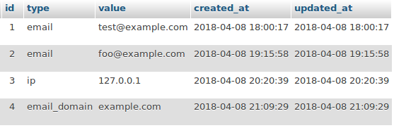

AntoineLemaireBlacklistBundle
=================

Blacklist system with integration in Symfony. Just insert blacklist value/type combinaison inside database and use Annotation to assert.




Installation
-----------------------------------

Add the package to your composer.json file
```
"antoinelemaire/blacklist-bundle": "dev-master",
```

Add this to app/AppKernel.php
```php
<?php
    public function registerBundles()
    {
        $bundles = array(
            ...
            new AntoineLemaire\BlacklistBundle\AntoineLemaireBlacklistBundle(),
        );

        ...

        return $bundles;
    }
```


Configuration
-------------


### Sonata admin:

```yaml
sonata_admin:
    dashboard:
        groups:
            antoinelemaire_blacklist:
                label: Blacklist
                label_catalogue: AntoineLemaireBlacklistBundle
                items:
                    - AntoineLemaire\BlacklistBundle\Admin\BlacklistAdmin
```

Usage
------

Available types:
- `email`
- `email_domain` (when 'email=true' is defined, apply the constraint only on the domain part of the value)
- `ip`

```
class User
{
    /**
     * @var string
     
     * @IsNotBlacklisted(type="email")
     * @IsNotBlacklisted(type="email_domain", email=true)
     */
    private $email;
    
    /**
     * @var string
     
     * @IsNotBlacklisted(type="ip", message="This IP is blacklisted.")
     */
    private $ip;
    
}
```